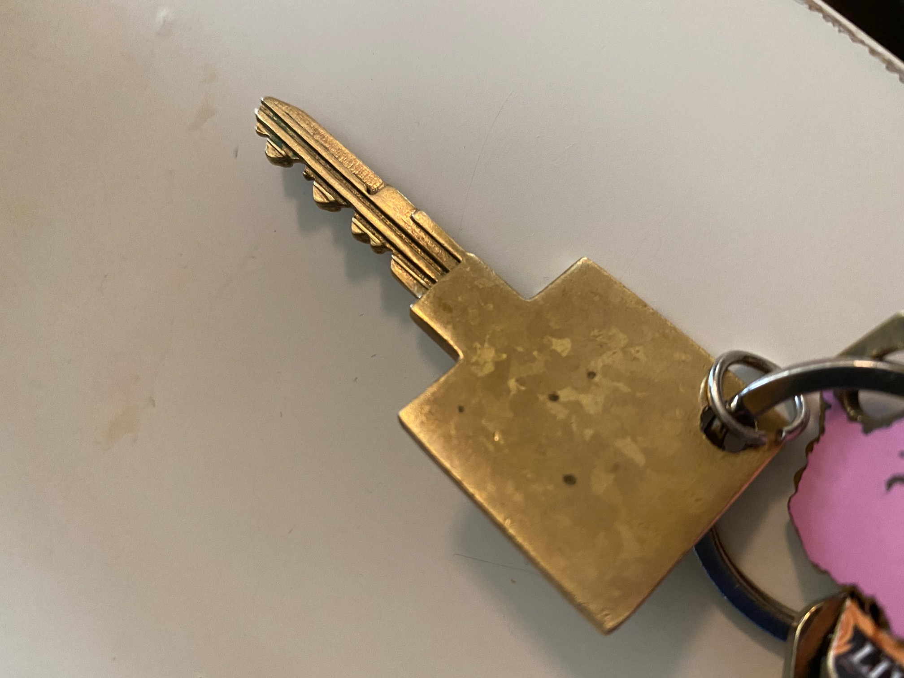

# 3D Printing Medeco M3 Biaxial Key

Polished Brass 

Medeco M3 Key is a high security key with patented protection and biaxial cut design. Its design and key control makes the duplication of M3 keys virtually impossible through any locksmiths. Medeco locks are claimed to secure places across U.S governement and military installations.

## Key Control

Key Control is the system implemented by lock manufacturer to control the distribution, duplication, and privilege level of keys. The main purpose of key control is to make locks more secure by limiting the access to key blanks and restricting methods of key duplication. For Medeco M3, only authorized locksmiths with license are able to install and distribute Medeco M3 locks and keys.

## Pin Codes with Axial Cut

The M3 locks are pin tumbler locks with pins of various length with axial rotation to prevent from opening the cylinder. Each cut has a possiblity of 6 depths, 3 angles and 3 horizontal offsets. The vertical depth of the key will be measured from the root of the key. Angles are left, right and center with 20 degree angle used. If cuts looked from the shoulder are made in clock wise, they are right cuts. There are also 3 types of spacing(Fore, Center, Aft) to each cuts. While Fore cuts come before the center point, Aft cuts are cuts made away from center points for original pin space. The dimensions for spacing and depth are shown below.
<table class="tg">
  <tr>
    <th class="tg-0pky"></th>
    <th class="tg-0pky" colspan="2">1</th>
    <th class="tg-0pky" colspan="2">2</th>
    <th class="tg-0pky" colspan="2">3</th>
    <th class="tg-0pky" colspan="2">4</th>
    <th class="tg-0pky" colspan="2">5</th>
    <th class="tg-0pky" colspan="2">6</th>
  </tr>
  <tr>
    <td class="tg-0pky"></td>
    <td class="tg-0pky">F</td>
    <td class="tg-0pky">A</td>
    <td class="tg-0pky">F</td>
    <td class="tg-0pky">A</td>
    <td class="tg-0pky">F</td>
    <td class="tg-0pky">A</td>
    <td class="tg-0pky">F</td>
    <td class="tg-0pky">A</td>
    <td class="tg-0pky">F</td>
    <td class="tg-0pky">A</td>
    <td class="tg-0pky">F</td>
    <td class="tg-0pky">A</td>
  </tr>
  <tr>
    <td class="tg-0pky">Spacing</td>
    <td class="tg-0pky">0.213"</td>
    <td class="tg-0pky">0.275"</td>
    <td class="tg-0pky">0.383"</td>
    <td class="tg-0pky">0.445"</td>
    <td class="tg-0pky">0.553"</td>
    <td class="tg-0pky">0.615"</td>
    <td class="tg-0pky">0.723"</td>
    <td class="tg-0pky">0.785"</td>
    <td class="tg-0pky">0.893"</td>
    <td class="tg-0pky">0.955"</td>
    <td class="tg-0pky">1.063"</td>
    <td class="tg-0pky">1.125"</td>
  </tr>
  <tr>
    <td class="tg-0lax">Depth</td>
    <td class="tg-0lax" colspan="2">0.272"</td>
    <td class="tg-0lax" colspan="2">0.247"</td>
    <td class="tg-0lax" colspan="2">0.222"</td>
    <td class="tg-0lax" colspan="2">0.197"</td>
    <td class="tg-0lax" colspan="2">0.172"</td>
    <td class="tg-0lax" colspan="2">1.42"</td>
  </tr>
</table>

## Side

The precision cuts on the side of the key push slider into the correct alignment with the sidebar. The keyway of M3 key seems widely varied by key blanks. Due to the restrictive nature of key blanks, the layout for keyway is well documented. However, it is fairly simple to replicate.

## OpenSCAD

[OpenSCAD](https://openscad.org/) is software for creating solid 3D CAD models. It is free software and available for Linux/UNIX, Windows and Mac OS X. Unlike most free software for creating 3D models (such as Blender) it does not focus on the artistic aspects of 3D modelling but instead on the CAD aspects. Thus it might be the application you are looking for when you are planning to create 3D models of machine parts but pretty sure is not what you are looking for when you are more interested in creating computer-animated movies.

## Reference
* [http://www.3ders.org/articles/20111031-duplicate-your-keys-with-a-3d-printer.html](http://www.3ders.org/articles/20111031-duplicate-your-keys-with-a-3d-printer.html)
* [https://www.forbes.com/sites/andygreenberg/2012/07/16/hacker-opens-high-security-handcuffs-with-3d-printed-and-laser-cut-keys/#6903f54e534c](https://www.forbes.com/sites/andygreenberg/2012/07/16/hacker-opens-high-security-handcuffs-with-3d-printed-and-laser-cut-keys/#6903f54e534c)
* [https://www.wired.com/2008/08/medeco-locks-cr/](https://www.wired.com/2008/08/medeco-locks-cr/)
* [https://www.youtube.com/watch?v=iOIRZnafgQk](https://www.youtube.com/watch?v=iOIRZnafgQk)
* [https://www.geek.com/chips/cheap-3d-printed-plastic-key-can-open-most-locks-1603073/](https://www.geek.com/chips/cheap-3d-printed-plastic-key-can-open-most-locks-1603073/)
* [http://reedbrotherssecurity.com/medeco-m3-biaxial/](http://reedbrotherssecurity.com/medeco-m3-biaxial/)
* [https://hackaday.com/2017/12/18/3d-printed-key-saves-the-day/](https://hackaday.com/2017/12/18/3d-printed-key-saves-the-day/)
* [http://lockwiki.com/index.php/Medeco_M3](http://lockwiki.com/index.php/Medeco_M3)
* [https://www.youtube.com/watch?v=FDcyqHvAt3Y](https://www.youtube.com/watch?v=FDcyqHvAt3Y)
* [https://www.thingiverse.com/thing:1819242](https://www.thingiverse.com/thing:1819242)
* [https://www.youtube.com/watch?v=l32mOvnT_ls](https://www.youtube.com/watch?v=l32mOvnT_ls)
* [https://hackaday.com/2015/05/23/pictures-that-defeat-key-locks/](https://hackaday.com/2015/05/23/pictures-that-defeat-key-locks)
* [https://www.wired.com/2015/08/this-app-lets-anyone-3-d-print-do-not-duplicate-keys/](https://www.wired.com/2015/08/this-app-lets-anyone-3-d-print-do-not-duplicate-keys)
* [http://www.instructables.com/id/3D-Print-a-Fully-Functional-Key/](http://www.instructables.com/id/3D-Print-a-Fully-Functional-Key)
* [http://web.archive.org/web/20050217020917fw_/http://dlaco.com/spacing/tips.htm](http://web.archive.org/web/20050217020917fw_/http://dlaco.com/spacing/tips.htm])
* [http://theamazingking.com/images/locks/m3/m3.html](http://theamazingking.com/images/locks/m3/m3.html)
* [http://www.locksafesystems.com/depth_and_space.htm#Medeco_Biaxial_M3_Space_and_Depth](http://www.locksafesystems.com/depth_and_space.htm#Medeco_Biaxial_M3_Space_and_Depth)
* [https://books.google.com/books?id=7m41LA8WsvUC&pg=PA290&lpg=PA290&dq=medeco+biaxial+spec&source=bl&ots=FFu5aQcb8d&sig=BbEBRSq49RcXcVJOdDrMN1cFbDk&hl=en&sa=X&ved=0ahUKEwi-0P7m4p3bAhXHCjQIHXFRAzA4ChDoAQg1MAI#v=onepage&q=medeco%20biaxial%20spec&f=false](https://books.google.com/books?id=7m41LA8WsvUC&pg=PA290&lpg=PA290&dq=medeco+biaxial+spec&source=bl&ots=FFu5aQcb8d&sig=BbEBRSq49RcXcVJOdDrMN1cFbDk&hl=en&sa=X&ved=0ahUKEwi-0P7m4p3bAhXHCjQIHXFRAzA4ChDoAQg1MAI#v=onepage&q=medeco%20biaxial%20spec&f=false)
